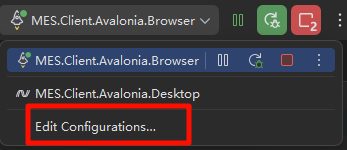

<!-- 这里是你的文章内容 -->

## 引言
记录Avalonia的使用看官方文档没有解决的问题，或者记录的一些有关使用Avalonia的特别技巧。  

## ISSUS

### Avalonia Browser 项目使用Rider启动报错

---

Error: Default system browser option is not supported for Blazor apps.
Please select a Chromium-based browser.

---

在Rideryo右上角DEBUG运行按钮。

  

拉到最下面，有一个 open browser 选项，在这里选着模块默认打开的浏览器即可  


### 打开的浏览器提示安全错误 net::ERR_CERT_AUTHORITY_INVALID 

net::ERR_CERT_AUTHORITY_INVALID 是因为 Avalonia.Browser 调试时用的是 ASP.NET 内置的 自签名 HTTPS 证书，而 Chrome 默认不信任它，所以就报这个警告。  

在 Rider 调试 Avalonia.Browser 项目的时候，Rider 会启动 Kestrel（或 ASP.NET）并监听 https://localhost:xxxx，这个证书是自动生成的，没有被系统或浏览器信任。  

**建议先尝试方式二**

#### 方式一

1. 确认证书已经生成  

在终端（PowerShell）里执行

```powershell
dotnet dev-certs https --check
```

如果没生成，会提示你创建证书。  

2. 重新生成并信任本地开发证书  

```powershell
dotnet dev-certs https --clean
dotnet dev-certs https --trust
```

--trust 会在系统里安装并信任这个证书（Windows 会弹出提示，点“是”即可）。

3. 确保 Chrome 使用的是系统信任
如果你之前已经打开过 Chrome 并忽略过证书错误，有时会缓存，需要清掉：

在 Chrome 访问 chrome://net-internals/#hsts

在 Delete domain security policies 输入 localhost，点击删除

重启 Chrome

4. Rider 设置调试浏览器
Avalonia.Browser 项目调试时，如果 Rider 默认用的是 “Default system browser”，它可能会打开 Edge 或未信任的 Chrome，你可以：

在 Run/Debug Configurations 中，选择 Custom browser 并指定 Chrome 的可执行文件路径

确保启动的 Chrome 没有加 --ignore-certificate-errors（否则无法验证是否生效）

#### 方式二

Properties/launchSettings.json 里，把 applicationUrl 从 https://localhost:xxxx 改成 http://localhost:xxxx

```json
"applicationUrl": "http://localhost:5235;https://localhost:7169",
```

让http在前面


## 结论
总结你的文章...