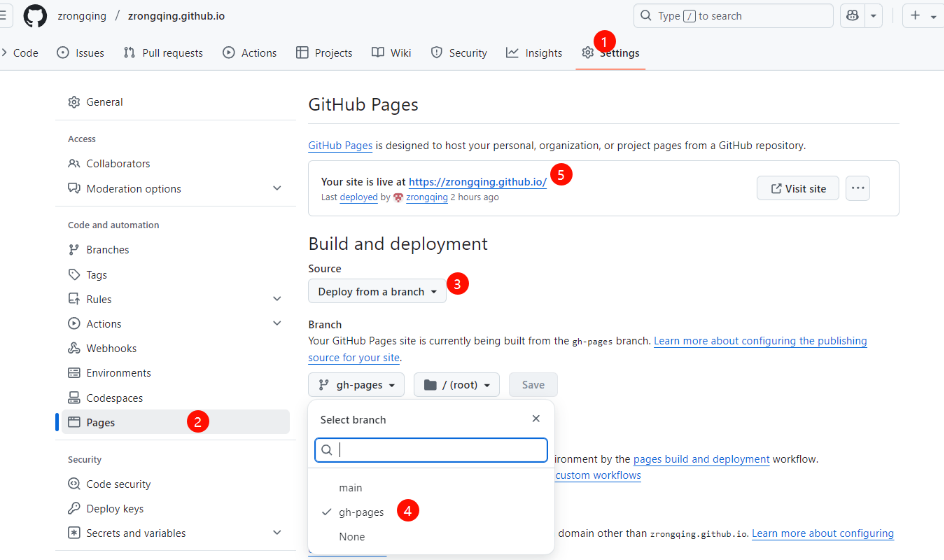
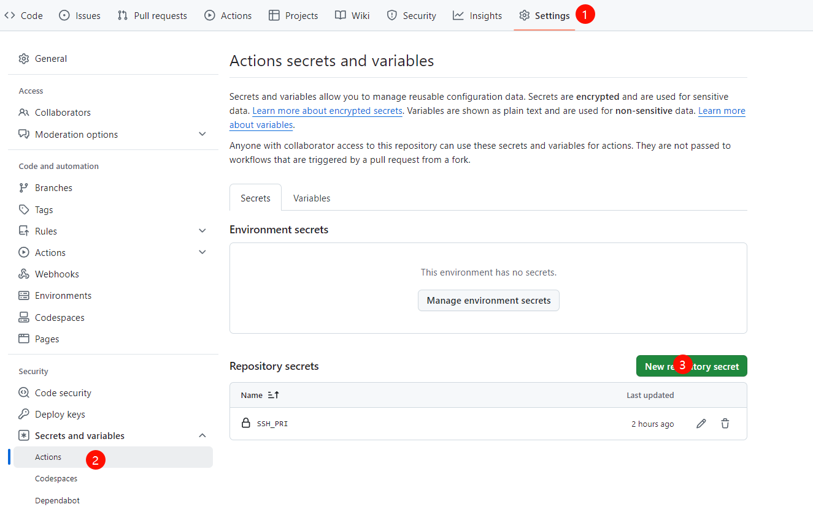

# Deploy Hexo to GitHub Pages

## 摘要

本文将介绍如何借助 Github Page 来搭建自己的博客（知识库），并实现提交代码（文本）到 Github 自动触发部署静态网页的流程。


因为本人目前工作主要是 C/S 架构的开发，目前所有的操作都是基于Windows操作说明。

## 前言

工作有几年了，手中的项目逐渐增多，随着解决的问题越来越多，常常忘记自己解决问题的思路，明明自己以前解决过，现在怎么就想不起来了呢。虽然有有借助 Obsidian 做各种记录，但是不方便分享，别人分享就会有点尴尬了。  

我由此想搭建自己的个人博客，用博客来记录自己各个项目的开发过程、遇到的问题和解决方案，作为自己的长期记忆，存放在电脑里，还可以作为自己的展示平台，把自己的能力通过实打实的项目展现出来。  

十分感谢 github 以及 hexo 的开源贡献者。

## 搭建步骤

### 准备工作

想要完成部署，要准备一些本地的开发环境。开发环境不在本文章详细介绍，以下给出相关链接，自行安装。

- [Git Downloads](https://git-scm.com/downloads)  
- [Git Install](https://git-scm.com/book/zh/v2/%e8%b5%b7%e6%ad%a5-%e5%ae%89%e8%a3%85-Git)
- [nodeJs Downloads](https://nodejs.cn/download/)
- [nodeJs Install](https://www.cnblogs.com/48xz/p/16146141.html)

验证Git环境：  
``` bash
git -v
```

验证NodeJs环境：  
``` bash
node -v
```

### Github Pages

[Github Pages](https://pages.github.com/) 官方其实为我们准备了一个教程，可以参考一下这个。

注意事项：  
https://github.com/username/username.github.io  
你的 github-username 必须匹配，不然无法工作，username 不是显示的名字，而是你克隆仓库的那个名字。  

如果你想修改这个名字，请参考以下步骤：  
点击你的头像，左侧找到 Account -> Change username，按照提示的步骤修改就好。

创建你的仓库，新增分支 gh-pages，main分支将作为 hexo 源码以及 markdown 文件的存档的分支，gh-pages则作为静态网页存放的地方。

打开你的仓库，点击 Settings -> Pages 



按照1，2，3，4完成设置，如果前面的设置正确，在5的位置，这就是博客域名。如果项目的名字没有匹配上规则，这里则不是这样的格式。

以上就完成了 Gihub Pages 上的配置。

### 安装Hexo

打开 PowerShell，运行以下命令，安装hexo
``` bash
npm install hexo -g
```

在本地新建一个空文件夹，在空文件夹，右键打开PowerShell，执行以下代码，初始化Hexo： 
``` bash
hexo init
```

本地预览：
``` bash
hexo g #生成静态页面
hexo s #启动服务器
```

根据提示，在浏览器中输入http://localhost:4000，即可访问本地网站。

### 部署Github

克隆上面准备的仓库到本地。  
``` bash
git clone git@github.com:zrongqing/zrongqing.github.io.git
```
这是我的仓库地址，修改你们自己的就好

将 hexo init 生成的文件直接复制到克隆下的仓库里面。记得Commit，将hexo保存到main分支。

在此文件夹，右键打开powershell，执行以下命令
``` bash
npm install hexo-deployer-git --save
```

打开文件夹中的_config.yml文件，拉倒最后，填写deploy模块
``` bash
# Deployment
## Docs: https://hexo.io/docs/one-command-deployment
deploy:
  type: git
  repository: git@github.com:zrongqing/zrongqing.github.io.git
  branch: gh-pages
```

hexo部署的时候，会以git部署到指定的repository里面的指定branch

执行发布

``` bash
hexo d
```

### 自动化部署

自动部署的核心是上传hexo源码，然后让github自动执行一个action，把源码编译成静态页面，并推送给gh-pages。

在仓库跟路径新建文件 ".github\workflows\deploy.yml"

```yml
name: Deploy Hexo to GitHub Pages

on:
  workflow_dispatch:
  push:
    branches:
      - main

jobs:
  build:

    runs-on: ubuntu-latest

    strategy:
      matrix:
        node-version: [22.x]

    steps:
    - uses: actions/checkout@v4
    - name: Install npm
      run: |
        npm install
        npm install hexo-asset-img --save
    - name: Prepare Github Identity
      env:
          HEXO_DEPLOY_PRI: ${{secrets.SSH_PRI}}
      run: |
        sudo timedatectl set-timezone "Asia/Shanghai"
        mkdir -p ~/.ssh/
        echo "$HEXO_DEPLOY_PRI" > ~/.ssh/id_rsa
        chmod 600 ~/.ssh/id_rsa
        ssh-keyscan github.com >> ~/.ssh/known_hosts
        git config --global user.name zrongqing
        git config --global user.email wyzrq163@163.com
    - name: Deploy Blog
      run: |
        npm run build
        npm run deploy
```

各个字段有什么含义，可以询问以下AI，这里不在重复。  

因为是自动部署，Github执行命令的时候会将自动形成的网页发布到gh-pages分支，肯定需要我们的SSH秘钥，具体如何配置秘钥可以参考 [github docs about ssh](https://docs.github.com/en/authentication/connecting-to-github-with-ssh/about-ssh)。如果能够通过ssh的方式能够上传代码就配置好了，不过都借用github搭建博客，这个大家应该都配置好了，所以就不多赘述了。


接下来，我们要将私钥添加到 GitHub Secrets，不然自动化无法通过。  

- 点击 Settings -> Secrets and variables -> Actions
- 点击 New repository secret，设置以下内容：
  - Name：SSH_PRI（这个名称需要与工作流中的 ${{ secrets.SSH_PRI }} 一致）。
  - Secret：粘贴私钥内容。
  - 保存

需要注意，git config --global 设置的用户名和邮箱需要与 GitHub 账户一致，否则可能会导致提交记录无法关联到你的账户。

这样自动化就能推送你的网页了。