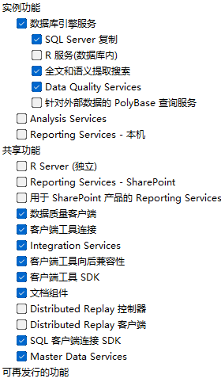

<!-- 这里是你的文章内容 -->

## 引言
在这里写下文章的开头...

<!-- more -->  <!-- 摘要分隔符 -->

## 相关链接

VMware-workstation-full-17.6.4.exe:
- [百度网盘](https://pan.baidu.com/s/1z_5QxpSKZgLdm8Qdk_wU1g?pwd=n2xv) 提取码：n2xv
- [123云盘](https://www.123684.com/s/JBYPTd-oV58H?pwd=oybi#) 提取码:oybi
- [百度云盘](https://www.alipan.com/s/eAPzXA38yb9) 提取码: hc60

26100.1742.240906-0331.ge_release_svc_refresh_SERVER_EVAL_x64FRE_zh-cn.iso:  
- [window server](https://pan.baidu.com/s/1z8d6fz4ae_fEFfs0zCw22Q) 提取码: 52pj

## 正文内容

**安装VMware：**
因为是破解版，没有哪些繁琐的个人版免费注册。  
下载好 VMware-workstation-full-17.6.4.exe 下一步下一步就好了。

**WindowsServer2025：**  
右击开始图标，以管理员身份运行终端，执行以下命令：

slmgr -ipk D764K-2NDRG-47T6Q-P8T8W-YP6DF  
slmgr -skms kms.0t.net.cn  
slmgr -ato  

Operating system edition    KMS Client Product Key  
Windows Server 2025 Standard    TVRH6-WHNXV-R9WG3-9XRFY-MY832  
Windows Server 2025 Datacenter  D764K-2NDRG-47T6Q-P8T8W-YP6DF  
Windows Server 2025 Datacenter: Azure Edition   XGN3F-F394H-FD2MY-PP6FD-8MCRC  

2025 数据中心版本使用这个
DISM /online /Set-Edition:ServerDatacenter /ProductKey:D764K-2NDRG-47T6Q-P8T8W-YP6DF /AcceptEula

**SqlServer2016**:  
密钥：MDCJV-3YX8N-WG89M-KV443-G8249

### VMware

没特别安装选项，一路安装就好

### WindowsServer2025

没特别安装选项，一路安装就好

在VMware里面安装完成后，可以将CPU核心和内存提高一点

### SqlServer2016

安装功能选择这些即可，不然可能还需要安装其他服务，后续如果有用上后面再安装即可。

## 结论
总结你的文章...